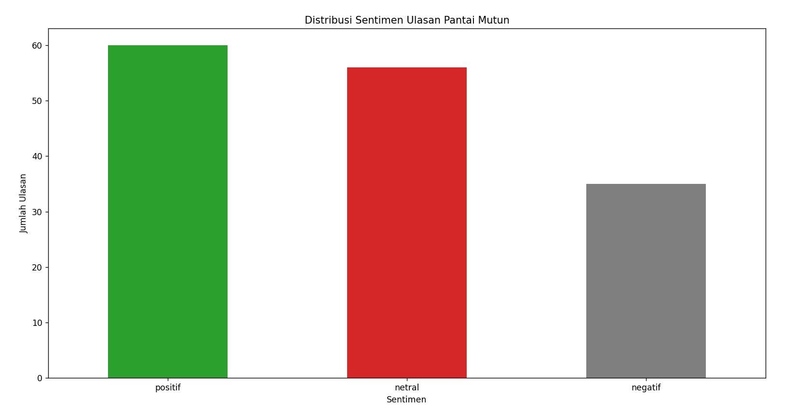
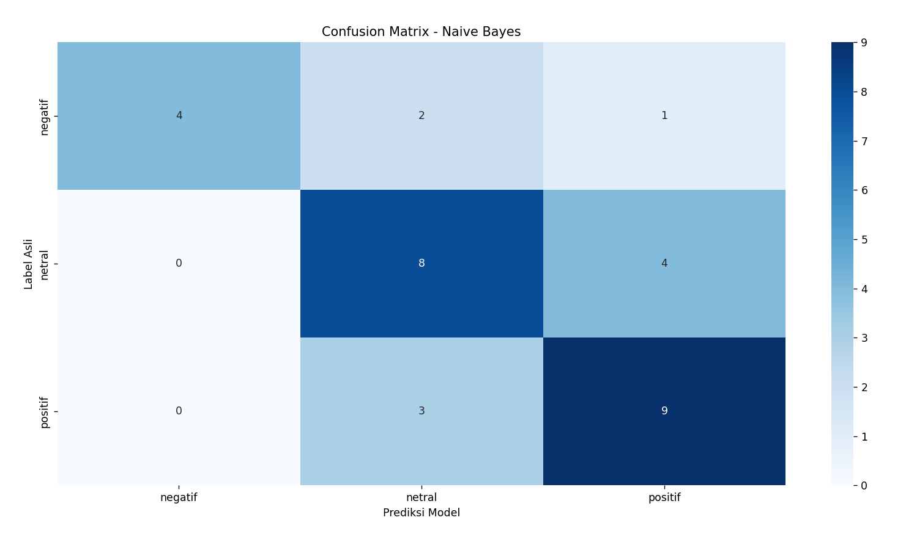

Sentiment Analysis of Google Maps Reviews for Pantai Mutun

Proyek End-to-End Machine Learning untuk mengumpulkan, membersihkan, dan menganalisis sentimen ulasan pengunjung Pantai Mutun dari Google Maps menggunakan algoritma Naive Bayes.

📌 Project Overview

Proyek ini bertujuan untuk menganalisis opini publik terkait pengalaman pengunjung di Pantai Mutun, seperti fasilitas, kebersihan, dan harga tiket. Data diambil langsung dari ulasan Google Maps menggunakan teknik web scraping, kemudian diproses menggunakan metode Natural Language Processing (NLP) untuk menentukan sentimen setiap ulasan.

Pipeline proyek ini mencakup:
- Pengambilan data ulasan dari internet
- Pembersihan dan normalisasi teks
- Pemberian label sentimen
- Pelatihan model Machine Learning
- Evaluasi model dan visualisasi hasil

## 🏆 Model Performance & Key Insights

### Kinerja Model (Mengapa Naive Bayes?)
Algoritma **Multinomial Naive Bayes** dipilih karena sangat efisien dan handal dalam menangani data teks berdimensi tinggi (matriks TF-IDF).
* **Akurasi Model:** Mencapai **[67.7%]** pada data uji.
* Model terbukti mampu membedakan sentimen positif dan negatif dengan baik, yang dibuktikan melalui visualisasi *Confusion Matrix*.

### Temuan Bisnis (Business Insights)
Dari ekstraksi ratusan ulasan pengunjung Pantai Mutun, ditemukan beberapa pola utama:
* **Kekuatan Utama (Positif):** Mayoritas pengunjung sangat menyukai **[pemandangan yang indah]**, menjadikannya nilai jual utama tempat wisata ini.
* **Area Perbaikan (Negatif):** Keluhan utama yang mendominasi sentimen negatif berpusat pada **[harga tiket yang mahal]**. Insight ini dapat menjadi rekomendasi strategis bagi pengelola untuk meningkatkan kepuasan pengunjung.

📊 Dataset
Sumber Data: Google Maps Reviews
Lokasi: Pantai Mutun, Lampung
Jumlah Data: ±150 ulasan pengunjung
Distribusi sentimen ulasan:
- Positif : 60
- Negatif : 56
- Netral : 35
Dataset dikumpulkan secara otomatis menggunakan Selenium Web Scraping.

🛠 Tools & Technologies
- Programming Language
- Python
- Web Scraping
- Selenium
- Chromedriver
- Data Processing
- Pandas
- Regex
- Sastrawi (Indonesian stemming & stopword removal)
- Machine Learning
- Scikit-learn
- TF-IDF Vectorization
- Multinomial Naive Bayes
- Visualization
- Matplotlib
- Seaborn

## 🔄 Project Workflow
1. **Data Scraping**  
Mengambil ulasan Google Maps menggunakan Selenium.

2. **Text Preprocessing**  
Lowercasing, cleaning text, stopword removal, dan stemming menggunakan Sastrawi.

3. **Sentiment Labeling**  
Memberikan label sentimen menggunakan pendekatan lexicon-based.

4. **Machine Learning Model**  
Melatih model Multinomial Naive Bayes menggunakan TF-IDF.

⭐ Special Feature: Negation Handling
Pada tahap preprocessing, program dimodifikasi agar tidak menghapus kata negasi seperti:
- tidak
- bukan
- jangan
Hal ini penting untuk menjaga makna kalimat.
Contoh:
"tidak bagus" → tetap mempertahankan kata "tidak"
Tanpa teknik ini, kalimat bisa berubah makna menjadi: "bagus"
yang dapat menyebabkan kesalahan klasifikasi sentimen.

📈 Data Visualization
### Sentiment Distribution

### Confusion Matrix

🚀 How to Run the Project
1. Clone Repository
git clone https://github.com/dzkafif/sentiment-analysis-pantai-mutun.git 
cd sentiment-analysis-pantai-mutun
2. Install Dependencies
pip install -r requirements.txt
3. Run the Pipeline

Jalankan setiap tahap secara berurutan:
python 01_scraping.py
python 02_preprocessing.py
python 03_labeling.py
python 04_naive_bayes.py

Author:
Muhammad Dzakwan Afifs
Information Systems Student

GitHub:
https://github.com/dzkafif